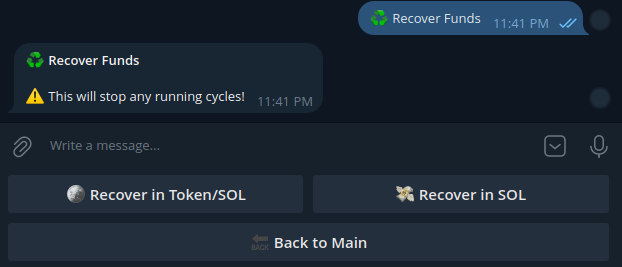

  <h1>alphaMAKER by alphaTOOLS</h1>
  
alphaMAKER is the most advanced market maker and volume bot for the Solana network, designed specifically for pump.fun tokens. Unlike any other bot, alphaMAKER delivers unparalleled performance, customization, and control to boost your token's visibility and trading activity.

  

    
  

  <h2>Why Choose alphaMAKER?</h2>
  <ul>
    <li><strong>Realistic Trading Activity</strong>: Each maker uses warm wallets with extensive trading histories, indistinguishable from real users. This triggers trending algorithms on DEXs and boosts your token’s “excitement” factor.</li>
    <li><strong>Scalable Makers</strong>: Add as many makers as you need to drive volume and interest in your token.</li>
    <li><strong>alphaAI-Powered Customization</strong>: Built-in AI reviews your token and tailors settings to your specific needs, with the ability to adjust settings on the fly.</li>
    <li><strong>Full Control</strong>: Pause, resume, or stop the bot at any time. Recover your funds or tokens whenever you want.</li>
    <li><strong>Cost-Effective</strong>: Affordable upfront costs, with only transaction/gas fees and slippage after the initial funding. Upward trending charts can even generate profits!</li>
    <li><strong>High Performance</strong>: Each bot processes up to 4 transactions per second. Run multiple bots to increase transaction speed (e.g., 2 bots for 8 tx/s).</li>
  </ul>
  

    
  

  <h2>How It Works</h2>
  

    
  

  <ol>
    <li><strong>Set your Token CA</strong>: Enter the token address for the chart the bot will be working on.</li>
  </ol>
  

    
  

  <ol start="2">
    <li><strong>Choose Your Settings</strong>: Set your primary settings. Each maker wallet is funded and then assigned a batch of additional warm wallets for the trading process. The bot will make transactions at + or - 15% of your set buy amount and will hold the tokens for a period of time randomly selected within your defined buy cycle.</li>
  </ol>
  

    
  

  <ol start="3">
    <li><strong>Fund Wallets</strong>: The bot will automatically determine the minimum deposit necessary based on your settings, any additional funds deposited beyond the minimum buy amount is recommended and will be divided and distributed between your makers.</li>
    <li><strong>Run</strong>: BOOST Your chart, add new holders and generate organic volume which will automatically draw attention to your token; pause or adjust your settings at any time.</li>
  </ol>
  

    
  

  <ol start="5">
    <li><strong>Recover</strong>: When finished you simply withdraw any remaining SOL/tokens, minus cost and txn fees.</li>
  </ol>

  <h2>Cost</h2>
  
Costs below are based on the amount of SOL used to fund the wallets, this covers all the makers and additional warm wallets that are assigned to the user from the moment they are funded and remain assigned to that user until funds have been removed and the wallets verified as empty.

  <h3>Fund with 0.25 SOL or less: Cost 0.15 SOL</h3>
  <h3>Fund with 0.75 SOL or less: Cost 0.30 SOL</h3>
  <h3>More than 0.75 SOL: Cost 0.40 SOL</h3>
  
Note: Once the initial cost has been deduced from your deposit amount the only other charges/costs from that point forward will be entirely txn fees / gas fees.

  <h2>What can you expect?</h2>
  <h3>⚙️ Selected Settings</h3>
  
Makers: 2 &nbsp;&nbsp;&nbsp;&nbsp;&nbsp;&nbsp;&nbsp;&nbsp;&nbsp;&nbsp;&nbsp;&nbsp;&nbsp;&nbsp;&nbsp;&nbsp;&nbsp;&nbsp;&nbsp;&nbsp;&nbsp;&nbsp;&nbsp;&nbsp;&nbsp; Makers: 2 
  Buy Amount: 0.0250 SOL &nbsp;&nbsp;&nbsp;&nbsp;&nbsp;&nbsp;&nbsp;&nbsp; Buy Amount: 0.14 SOL 
  Buy Cycle: 10-20s &nbsp;&nbsp;&nbsp;&nbsp;&nbsp;&nbsp;&nbsp;&nbsp;&nbsp;&nbsp;&nbsp;&nbsp;&nbsp;&nbsp;&nbsp;&nbsp;&nbsp;&nbsp; Buy Cycle: 10-30s

  <h3>Results:</h3>
  
<em>Funded with - 0.25 SOL</em> &nbsp;&nbsp;&nbsp;&nbsp;&nbsp;&nbsp;&nbsp;&nbsp;&nbsp; <em>Funded with - 0.75 SOL</em> 
  Volume Generated: 9.375 SOL &nbsp;&nbsp;&nbsp;&nbsp; Volume Generated: 297.5 SOL 
  Runtime: 30 min &nbsp;&nbsp;&nbsp;&nbsp;&nbsp;&nbsp;&nbsp;&nbsp;&nbsp;&nbsp;&nbsp;&nbsp;&nbsp;&nbsp;&nbsp;&nbsp;&nbsp;&nbsp;&nbsp;&nbsp; Runtime: 177 min / 2.95 hrs

  
<em>Funded with - 1 SOL</em> 
  Volume Generated: 162.45 SOL 
  Runtime: 406.13 min / 6.77hrs

  <h2>Multi-bot Larger Scale Projects</h2>
  
For LARGE Scale Volume it’s NEVER been easier and more customizable, you can set exactly how much Volume you want to achieve and in how much time and let alphaTOOLS do the work for you. There’s 6 alphaMAKER bots currently running on Telegram, each bot is capable of 4-5 transactions per second, if you’re looking to get a lot of volume in a very short amount of time then running multiple bots is the way to go. Below are some examples of configurations our customers have ran in the past.

  <h3>Example 1</h3>
  
User had 3 SOL and wanted Max VOL while running for at least 3 hours:

  
Configuration: 3 instances. 
  Instance 1: 4 makers, 0.05 SOL, 5–10s. 
  Instance 2: 4 makers, 0.04 SOL, 3–6s. 
  Instance 3: 3 makers, 0.03 SOL, 2–4s. 
  Volume: ~$616,896.

  
That’s accounting for 15% slippage and a 20% chart movement. 600k in 3 hours.

  <h3>Example 2</h3>
  
Our first big test, user wanted max Volume for 6 SOL we deposited the 6 SOL into the bots and let them run full speed. After 1hr they generated 2.03 million in volume and the cost to run the bots was 1.5 SOL for bots and 1.34 SOL in transaction fees. The user was able to recover a little over 3 SOL after we finished testing.

  
We ran 4 alphaMAKER bots 1-3 SEC. Cycles. 
  Generating 15-20 transactions per second

  
Transaction Cost $ @ 1-3sec cycles: 
  15 min: 0.334125 SOL = $60.14 
  30 min: 0.66825 SOL = $120.85 
  60 min: 1.3365 SOL = $240.57

  
Volume Generated $ @ 1-3sec cycles: 
  15 min: 2819.25 SOL = $507,465 
  30 minutes: 5638.5 SOL = $1,014,930 
  60 minutes: 11277 SOL = $2,029,860

  
Note: Slippage and chart movement may affect results, for example on an upward moving chart you can expect to receive better results.

  <h2>Get Started</h2>
  
We’re not sharing the code publicly, but you can access alphaMAKER by joining our Telegram group or messaging our bots directly:

  
📢 Join the Community: <a href="https://t.me/alphat00ls">t.me/alphat00ls</a> 
  📨 Message: <a href="https://t.me/alphab0ing">@alphab0ing</a> 
  🤖 Run the Bots Directly: 
  <a href="https://t.me/alphaMaker1_bot">@alphaMaker1_bot</a> | <a href="https://t.me/alphaMaker2_bot">@alphaMaker2_bot</a> | <a href="https://t.me/alphaMaker3_bot">@alphaMaker3_bot</a> | <a href="https://t.me/alphaMaker4_bot">@alphaMaker4_bot</a> | <a href="https://t.me/alphaMaker5_bot">@alphaMaker5_bot</a> | <a href="https://t.me/alphaMaker6_bot">@alphaMaker6_bot</a>

  <h2>What’s coming?</h2>
  <h3><a href="https://t.me/alphaMAKERv2_bot">alphaMAKER-2.0</a> <em>beta</em></h3>
  
Currently in its testing phases, alphaMAKER-2.0 has the original alphaMAKER built in as well as a FOMO Strategy designed to run up the chart creating a green candle to draw in new buyers playing to their ‘fear of missing out’, the bot will then grab up the liquidity from those new buyers entering the chart making a profit and then sending up an even larger candle to create even more ‘FOMO’, this bot will push your chart all by itself and works very well.

  <h3><a href="https://t.me/fbraiderbot">alphaRAIDER</a> <em>beta</em></h3>
  
alphaRAIDER is the first of its kind, specifically made for Telegram Groups and token dev teams, the bot will collect and share Facebook links for your group to raid. You can complete timed raids and get your group ranked vs. other token groups. This free bot is advertising supported and the Telegram groups with the highest raid scores can have their token banner displayed on all instances of alphaRAIDER throughout the degen community to draw in more visibility and holders for their token.

  <h3>$-ALPHATOOLS SOLANA Token Release</h3>
  
<a href="https://t.me/alphat00ls">alphaTOOLS</a> token release is coming very soon. To keep yourself up to date on news, upcoming bot releases and most importantly on the token release date make sure you come by our Telegram <a href="https://t.me/alphat00ls">community</a>.

  
🔥🔥 <a href="https://t.me/alphat00ls">alphaTOOLS</a> has the best, latest and greatest! 🚀 Pump.Fun / Solana Meme Coin Tools for Token DEVS and Traders. Made by degens for the degen community!! 🔥🔥

</body>
</html>
